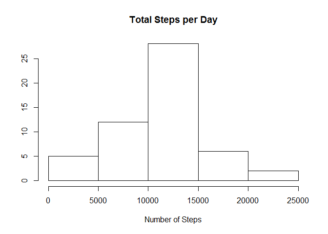
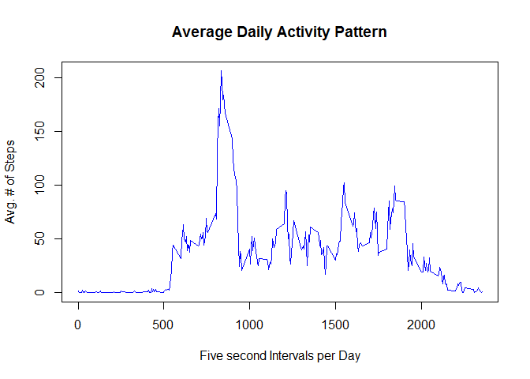
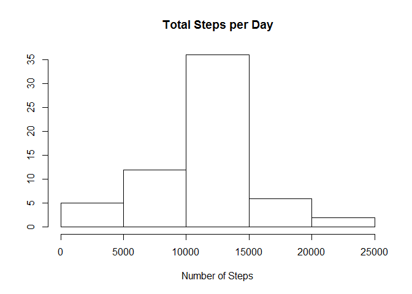
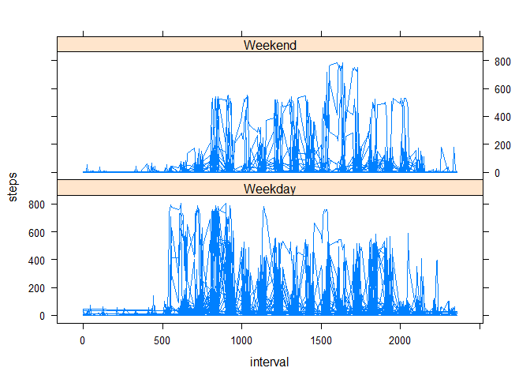

# Reproducible Research: Peer Assessment 1
Jeff B.  
Tuesday, June 09, 2015  


## Loading and preprocessing the data

```r
activity <- read.csv("activity.csv")
```

## What is mean total number of steps taken per day?

### Total Steps Per Day

This is a histogram of the total steps taken each day.


```r
steptotals <- aggregate(steps ~ date, activity, sum)
hist(steptotals$steps, main = "Total Steps per Day", xlab = "Number of Steps", ylab = "")
```

 

### Mean and Median of Daily Steps

Calculating the mean and median:


```r
options("scipen" = 20)
steps_mean <- mean(steptotals$steps)
steps_median <- median(steptotals$steps)
```

The mean total number of steps per day is 10766.1886792 and the median is 10765.

## What is the average daily activity pattern?

## Calculating Daily Average Steps by Interval

Preparing dataset for time series plotting: 


```r
library(dplyr)
```

```
## 
## Attaching package: 'dplyr'
## 
## The following object is masked from 'package:stats':
## 
##     filter
## 
## The following objects are masked from 'package:base':
## 
##     intersect, setdiff, setequal, union
```

```r
dailyavgs <- summarize(group_by(activity, interval), steps = mean(steps, na.rm = TRUE))
```

### Time Series Plot

Time series plot of average steps per 5-minute intervals:


```r
plot(dailyavgs$interval, dailyavgs$steps, type = "l", col = "blue", main = "Average Daily Activity Pattern", xlab = "Five second Intervals per Day", ylab = "Avg. # of Steps")
```

 

### Maximum steps for an interval in an average day

Calculating the interval with the most steps on average each day.


```r
maxsteps <- dailyavgs$interval[which(dailyavgs$steps == max(dailyavgs$steps, na.rm = TRUE))]
```

The interval with the most steps on average each day is 835.

## Imputing missing values

### Calculating Missing Values

Calculating the number of missing values ("NAs"):


```r
na_sums <- sum(is.na(activity$steps))
```

The total number of missing values in the dataset is 2304.

### Imputing missing values

There are 61 days of data, with only 8 (13%) missing data on the number of steps.  Based on the available data, I believe that it is easiest to assign the already calculated daily activity averages for each interval to each day that is missing values.  Various other random assignment formulas might be more accurate or appropriate, but given the purpose of this assignment is to display our grasp of R markdown and producing reports outlining reproducible research, I believe this approach is sufficient.


```r
imputed_vals <- rep(dailyavgs$steps, 8)
blank_days <- subset(activity, is.na(activity$steps) == TRUE)
filled_days <- subset(activity, is.na(activity$steps) == FALSE)
blank_days_filled <- select(blank_days, date, interval)
blank_days_filled <- mutate(blank_days_filled, steps = imputed_vals)
activity_filled <- rbind(filled_days, blank_days_filled)
```

### Total Steps per Day with Imputed Data

This is a histogram of the total steps taken each day after the imputed data has been added.


```r
newsteptotals <- aggregate(steps ~ date, activity_filled, sum)
hist(newsteptotals$steps, main = "Total Steps per Day", xlab = "Number of Steps", ylab = "")
```

 

Calculating the mean and median:


```r
options("scipen" = 20)
new_steps_mean <- mean(newsteptotals$steps)
new_steps_median <- median(newsteptotals$steps)
```

The mean total number of steps per day is 10766.1886792 and the median is 10766.1886792.  Because of the strategy used to impute the data for the missing 8 days, there is little change in these figures from prior to the imputation.  The mean changes by 0 and the median changes by 1.1886792.  As is indicated by these minimal changes, the only  the impact of imputing missing data on the estimates of the total daily number of steps is to bring it  closer to the existing mean, because the only change was to add 8 days in which the total daily number of steps was equal to the mean total daily number of steps.

## Are there differences in activity patterns between weekdays and weekends?

### Calculating day of week and dayclass (weekday vs. weekdn)

Adding variables to the dataset that indicate whether the date in question is a weekday (Monday through Friday) or part of the weekend (Saturday or Sunday).


```r
activity_filled <- mutate(activity_filled, day = weekdays(as.Date(activity_filled$date)), dayclass = "")
for (x in 1:nrow(activity_filled)) {
    if (("Saturday" %in% activity_filled$day[x]) | ("Sunday" %in% activity_filled$day[x])) {
        activity_filled$dayclass[x] <- "Weekend"
    }
    else {
        activity_filled$dayclass[x] <- "Weekday"
    }
}
activity_filled <- mutate(activity_filled, dayclass = factor(dayclass))
```

### Panel Plot Comparison

Panel plot comparing average daily steps per interval for weekdays vs. weekends.


```r
weeklyavgs <- summarize(group_by(activity_filled, dayclass, interval), steps = mean(steps, na.rm = TRUE))
library(lattice)
xyplot(steps ~ interval | dayclass, data = activity_filled, layout = c(1,2), type ="l")
```

 


